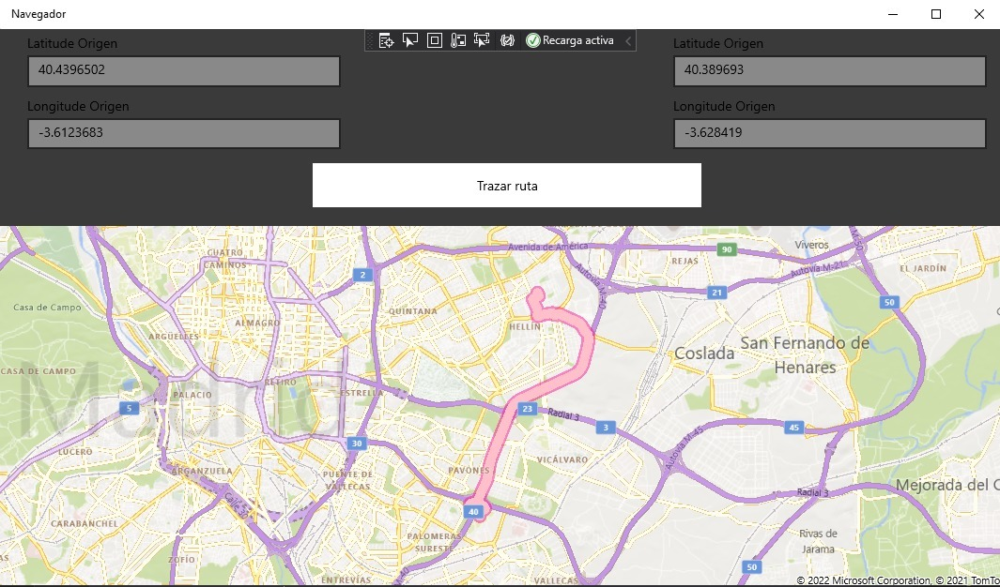

## Description

Application developed in Visual Studio with programming language UWP - C# and the Google API, which allows the user to trace a route from a point of origin to a destination point, for this it is necessary to put the corresponding latitudes and longitudes.

## Author

**Alejandro Martinez**

* [LinkedIn](https://www.linkedin.com/in/diego-alejandro-martinez-espinosa-571086134)

## Screenshots 
    

## Environment Variables

To run this project, you'll need to add your own environment variables to your file: MainPage.xaml

`GOOGLE_MAPS_API_KEY`

## Installation

This project requires to be installed on windows devices.

## Feedback

If you have any feedback, please reach out to us at dreamstime@outlook.es
